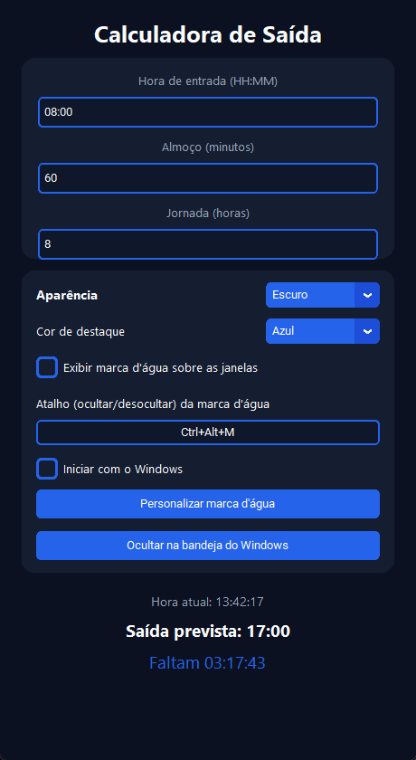
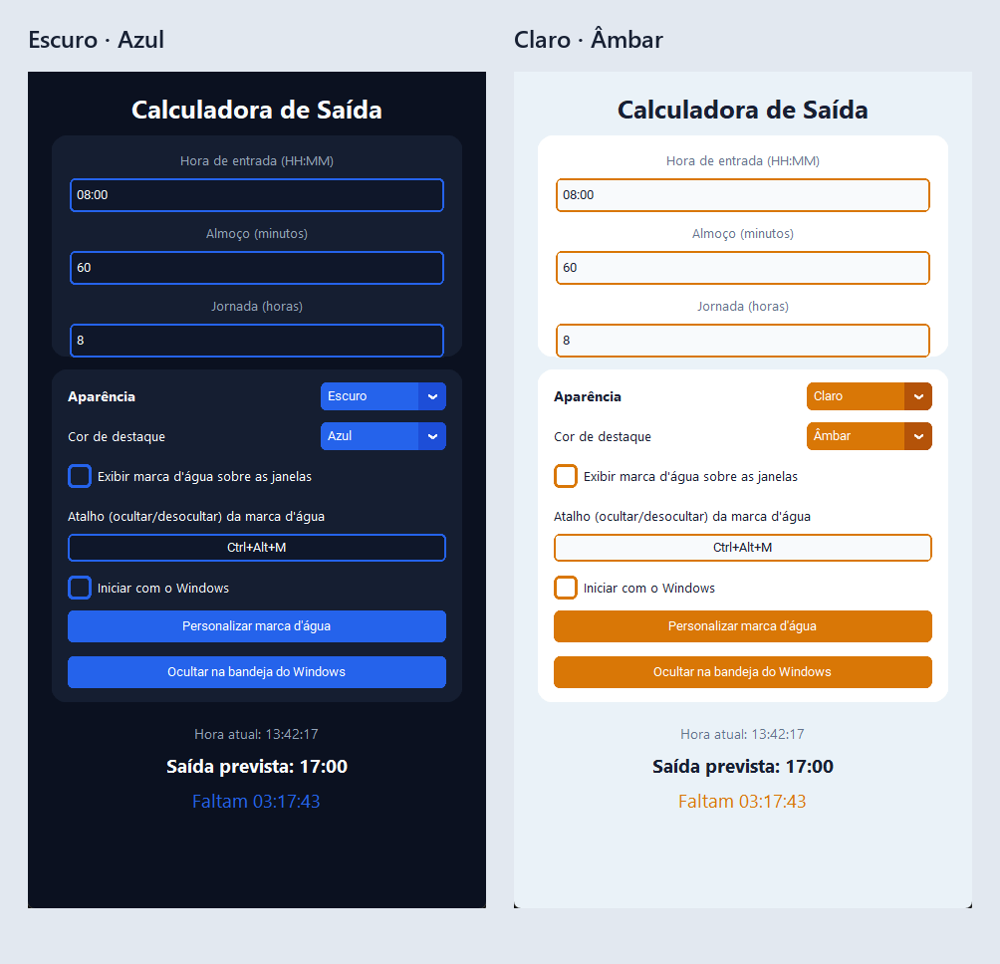
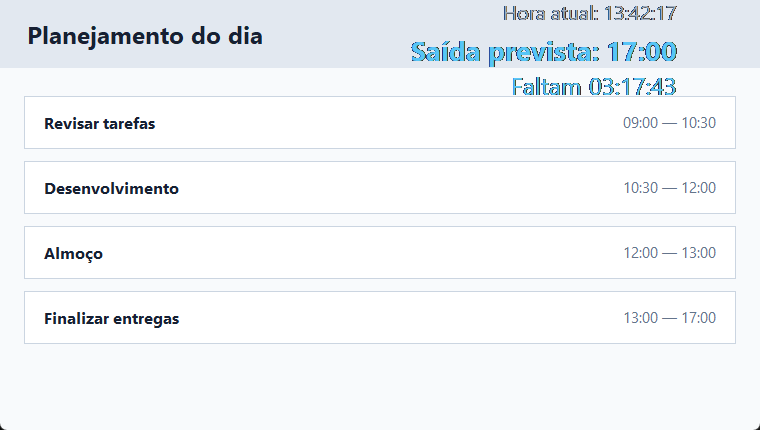
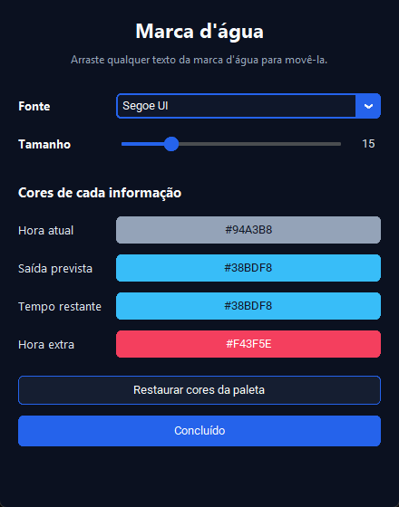
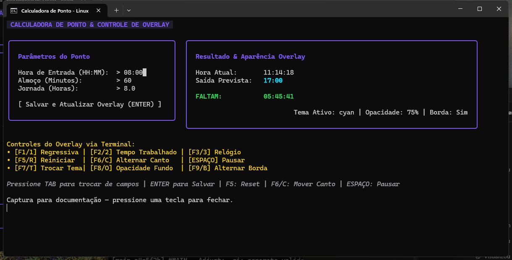

# Calculadora de Ponto

Aplicativo para calcular a saída do trabalho a partir da hora de entrada, do
intervalo de almoço e da duração da jornada. O resultado é atualizado a cada
segundo e mostra quanto tempo falta para a saída ou quanto tempo já foi
trabalhado como hora extra.

O projeto possui duas implementações:

| Plataforma | Interface | Recursos principais |
| --- | --- | --- |
| Windows | Aplicativo gráfico em Python | Temas, marca d'água, atalho global, bandeja e inicialização automática |
| Linux | Painel de terminal em Go | TUI interativa e cronômetro overlay com modos e temas |

## Sumário

- [Funcionalidades](#funcionalidades)
- [Instalação](#instalação)
- [Como usar no Windows](#como-usar-no-windows)
- [Como usar no Linux](#como-usar-no-linux)
- [Executar a partir do código-fonte](#executar-a-partir-do-código-fonte)
- [Testes e builds](#testes-e-builds)
- [Configurações salvas](#configurações-salvas)
- [Estrutura do projeto](#estrutura-do-projeto)
- [Builds e releases automáticos](#builds-e-releases-automáticos)

## Funcionalidades

- Cálculo automático da saída a partir de entrada, almoço e jornada.
- Relógio atual e contagem regressiva atualizados em tempo real.
- Indicação automática de hora extra depois do horário previsto.
- Preferências persistidas entre as execuções.
- Overlay opcional para acompanhar os horários sobre outras janelas.
- Distribuições prontas para Windows, Debian/Ubuntu, Fedora e Arch Linux.

### Recursos exclusivos do Windows

- Aparência Escura, Clara ou igual ao sistema.
- Paletas Azul, Verde, Roxo e Âmbar.
- Marca d'água transparente, sempre visível e arrastável entre monitores.
- Fonte, tamanho e cores da marca d'água personalizáveis.
- Atalho global configurável para ocultar ou exibir a marca d'água.
- Execução em segundo plano pela bandeja do Windows.
- Inicialização automática com o Windows, já oculta na bandeja.

### Recursos exclusivos do Linux

- Painel interativo no terminal.
- Overlay com contagem regressiva, tempo trabalhado ou relógio.
- Temas Cyan, Matrix Green, Cyberpunk Pink, Amber Gold e Minimal White.
- Posição, opacidade e borda do overlay controladas pelo teclado.

## Instalação

Os pacotes prontos estão disponíveis na página de
[Releases](https://github.com/lucasfhs/calculo_ponto/releases/latest).

### Windows

1. Baixe `calculo-ponto_VERSAO_windows_x86_64_setup.exe`.
2. Execute o instalador.
3. Abra **Calculadora de Ponto** pelo Menu Iniciar ou pelo atalho criado.

O instalador inclui atalhos, desinstalador, ícone e os créditos do projeto.

### Debian e Ubuntu

```bash
sudo apt install ./calculo-ponto_*_amd64.deb
```

### Fedora

```bash
sudo dnf install ./calculo-ponto-*.x86_64.rpm
```

### Arch Linux

```bash
sudo pacman -U ./calculo-ponto-*-x86_64.pkg.tar.zst
```

### Binário Linux portátil

Extraia `calculo-ponto_VERSAO_linux_x86_64.tar.gz` e execute:

```bash
chmod +x calculo-ponto
./calculo-ponto
```

## Como usar no Windows

### 1. Calcular o horário de saída



1. Informe a **Hora de entrada** no formato `HH:MM`.
2. Informe o **Almoço** em minutos.
3. Informe a **Jornada** em horas. Valores decimais, como `7.5`, são aceitos.
4. Consulte na parte inferior a hora atual, a saída prevista e o tempo
   restante.

Não é necessário pressionar um botão: o cálculo é refeito automaticamente.
Depois da saída prevista, a contagem muda de **Faltam** para **Hora extra**.
Campos inválidos exibem a mensagem **Dados inválidos.**

### 2. Escolher aparência e cor de destaque



Use os seletores da seção **Aparência**:

- **Aparência:** escolha `Escuro`, `Claro` ou `Sistema`.
- **Cor de destaque:** escolha `Azul`, `Verde`, `Roxo` ou `Âmbar`.

A alteração é aplicada imediatamente e permanece salva para a próxima
execução.

### 3. Exibir a marca d'água



1. Marque **Exibir marca d'água sobre as janelas**.
2. Arraste qualquer uma das três linhas para reposicionar o overlay.
3. Para ocultá-lo ou exibi-lo sem abrir o aplicativo, use o atalho mostrado no
   campo. O padrão é `Ctrl+Alt+M`.
4. Para trocar o atalho, digite uma nova combinação e pressione `Enter`.

O atalho aceita combinações com `Ctrl`, `Alt`, `Shift` ou `Win`, além das
teclas `F1` a `F24`. Ele continua funcionando enquanto o aplicativo estiver na
bandeja.

### 4. Personalizar a marca d'água



Clique em **Personalizar marca d'água** para:

- escolher a família da fonte;
- ajustar o tamanho entre 9 e 36;
- definir cores independentes para hora atual, saída prevista, tempo restante
  e hora extra;
- restaurar as cores correspondentes à paleta selecionada.

As alterações aparecem no overlay e são salvas automaticamente. Clique em
**Concluído** para fechar a janela.

### 5. Usar a bandeja do Windows

Clique em **Ocultar na bandeja do Windows** ou feche a janela pelo `X` para
manter o aplicativo em segundo plano.

No ícone da bandeja:

- dê dois cliques ou selecione **Abrir** para restaurar a janela;
- selecione **Alternar marca d'água** para mostrar ou ocultar o overlay;
- selecione **Sair** para encerrar completamente o aplicativo.

Marque **Iniciar com o Windows** para abrir o aplicativo automaticamente, já
oculto na bandeja, depois de entrar na sua conta.

## Como usar no Linux



Ao executar `calculo-ponto`, o painel interativo abre no terminal e o overlay
flutuante aparece na área de trabalho.

1. Use `Tab` e `Shift+Tab` para navegar entre os três campos e o botão
   **Salvar**.
2. Edite entrada, almoço e jornada.
3. Pressione `Enter` ou `Ctrl+S` para salvar e atualizar o overlay.
4. Pressione `Esc` ou `Ctrl+C` para sair.

### Modos do cronômetro

| Tecla | Ação |
| --- | --- |
| `F1` | Mostrar a contagem regressiva até a saída |
| `F2` | Mostrar o tempo trabalhado |
| `F3` | Mostrar o relógio em tempo real |
| `F5` | Reiniciar o cronômetro |
| `F6` | Mover o overlay para o próximo canto |
| `F7` | Trocar o tema de cores |
| `F8` | Trocar a opacidade do fundo |
| `F9` | Exibir ou ocultar a borda |

Com o foco no botão **Salvar**, também é possível usar `1`, `2`, `3`, `R`,
`C`, `T`, `O`, `B` e `Espaço` como atalhos equivalentes. `Espaço` pausa ou
retoma o cronômetro.

Os horários também podem ser definidos ao iniciar o programa:

```bash
calculo-ponto --entrada 08:30 --almoco 45 --jornada 8.5
```

## Executar a partir do código-fonte

### Windows — Python

Requisitos: Python 3 e Windows.

```powershell
python -m venv .venv
.\.venv\Scripts\Activate.ps1
python -m pip install -r requirements-build.txt
python app.py
```

### Linux — Go

Requisitos: Go e as bibliotecas de desenvolvimento usadas pelo Gio. Em Debian
ou Ubuntu:

```bash
sudo apt install libc6-dev libgl1-mesa-dev libxcursor-dev libxi-dev \
  libxinerama-dev libxrandr-dev libxxf86vm-dev libasound2-dev pkg-config
cd linux/calculo_ponto
go run .
```

## Testes e builds

### Windows

```powershell
python -m unittest discover -s tests -v
pyinstaller app.spec
```

### Linux

```bash
cd linux/calculo_ponto
go test ./...
go build -o calculo-ponto .
```

## Configurações salvas

| Plataforma | Arquivo |
| --- | --- |
| Windows | `%APPDATA%\CalculoPonto\config.json` |
| Linux | `~/.config/ponto/config.json` |

No Windows, a opção **Iniciar com o Windows** também gerencia a entrada
`CalculoPonto` em `HKCU\Software\Microsoft\Windows\CurrentVersion\Run`.

## Estrutura do projeto

```text
.
├── app.py                         # Aplicativo gráfico para Windows
├── app.spec                       # Empacotamento do executável Windows
├── assets/                        # Ícone do aplicativo
├── docs/images/                   # Capturas usadas neste guia
├── linux/calculo_ponto/           # Implementação Linux em Go
│   ├── internal/calculator/       # Regras de cálculo
│   ├── internal/config/           # Persistência das preferências
│   ├── internal/overlay/          # Overlay gráfico
│   ├── internal/timer/            # Modos do cronômetro
│   └── internal/ui/               # Painel interativo do terminal
├── packaging/                     # Instalador do Windows
├── scripts/                       # Scripts auxiliares de build
└── tests/                         # Testes da implementação Python
```

## Builds e releases automáticos

A workflow **Build e Release** do GitHub Actions:

- testa as implementações Python e Go;
- gera o instalador `x86_64` para Windows;
- gera pacotes `.deb`, `.rpm` e `.pkg.tar.zst` para Linux;
- publica um binário Linux portátil e arquivos SHA-256;
- mantém os artefatos de cada execução disponíveis por 30 dias;
- cria uma tag incremental `v0.0.N` e uma GitHub Release para cada commit
  enviado ou mesclado na branch `main`.

Pull requests e execuções manuais geram os artefatos sem criar tags.

O instalador e o executável Windows identificam o publicador como
**PisJuliano e contribuidores**. O arquivo `AUTHORS.txt` é regenerado pela
pipeline a partir do histórico do Git.

Para habilitar assinatura Authenticode, configure:

- `WINDOWS_CERTIFICATE_BASE64`: conteúdo Base64 do certificado `.pfx`;
- `WINDOWS_CERTIFICATE_PASSWORD`: senha do certificado.

Sem esses secrets, o instalador continua sendo gerado, mas não recebe
assinatura criptográfica.

---

Bom trabalho e feliz cálculo de ponto!
